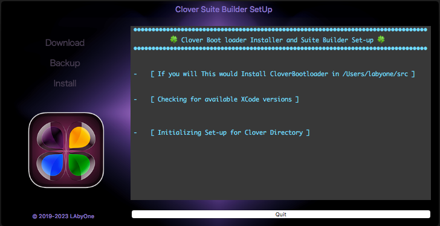
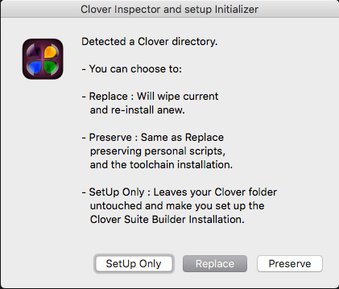
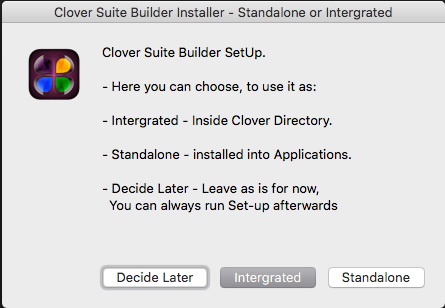
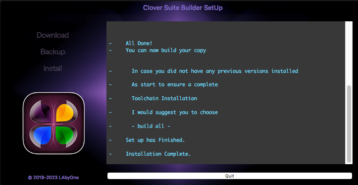

# Clover Suite Builder SetUp
CloverBootloader Installer and set up tool for Clover Suite Builder 
###

* Will Download, and install for you the CloverBootloader
* Setup the right hierarchically directories to build and update the Bootloader

* Check if a Pre-existing copy is already in place
* and eventually replace by wiping out older and downloading latest
* or, just replacing previous install, preserving all personal files

* Will setup the new Clover Suite Builder (if you choose so)
* givin you the choice to where install the new components
* as standalone application or directly inside the CloverBooloader directory

* You will be able in both cases to use all available tools it provides
* Both versions will be accessible as MenuBar Item
* as it already does now [its little brother](https://www.insanelymac.com/forum/topic/347872-clover-suite-builder/).

###

* **[⇩ Clover Suite Builder SetUp 2.1](https://github.com/LAbyOne/Clover-Suite-Builder-SetUp/)** 

Copyright (c) 2019-2023 LabyOne
All rights reserved.

THIS SOFTWARE IS PROVIDED BY THE COPYRIGHT HOLDERS AND CONTRIBUTORS "AS IS" AND
ANY EXPRESS OR IMPLIED WARRANTIES, INCLUDING, BUT NOT LIMITED TO, THE IMPLIED
WARRANTIES OF MERCHANTABILITY AND FITNESS FOR A PARTICULAR PURPOSE ARE DISCLAIMED.
IN NO EVENT SHALL THE COPYRIGHT HOLDER OR CONTRIBUTORS BE LIABLE FOR ANY DIRECT,
INDIRECT, INCIDENTAL, SPECIAL, EXEMPLARY, OR CONSEQUENTIAL DAMAGES (INCLUDING, BUT
NOT LIMITED TO, PROCUREMENT OF SUBSTITUTE GOODS OR SERVICES; LOSS OF USE, DATA, OR
PROFITS; OR BUSINESS INTERRUPTION) HOWEVER CAUSED AND ON ANY THEORY OF LIABILITY,
WHETHER IN CONTRACT, STRICT LIABILITY, OR TORT (INCLUDING NEGLIGENCE OR OTHERWISE)
ARISING IN ANY WAY OUT OF THE USE OF THIS SOFTWARE, EVEN IF ADVISED OF THE
POSSIBILITY OF SUCH DAMAGE.
